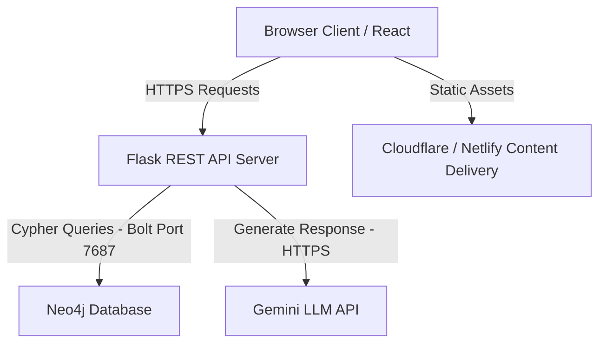
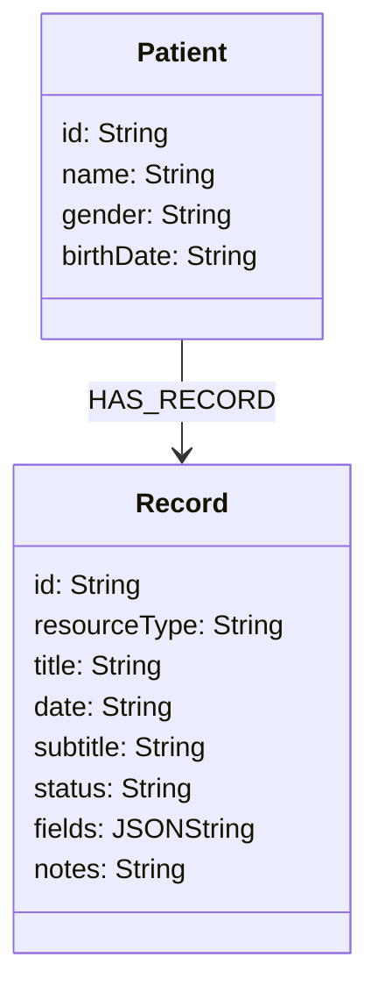
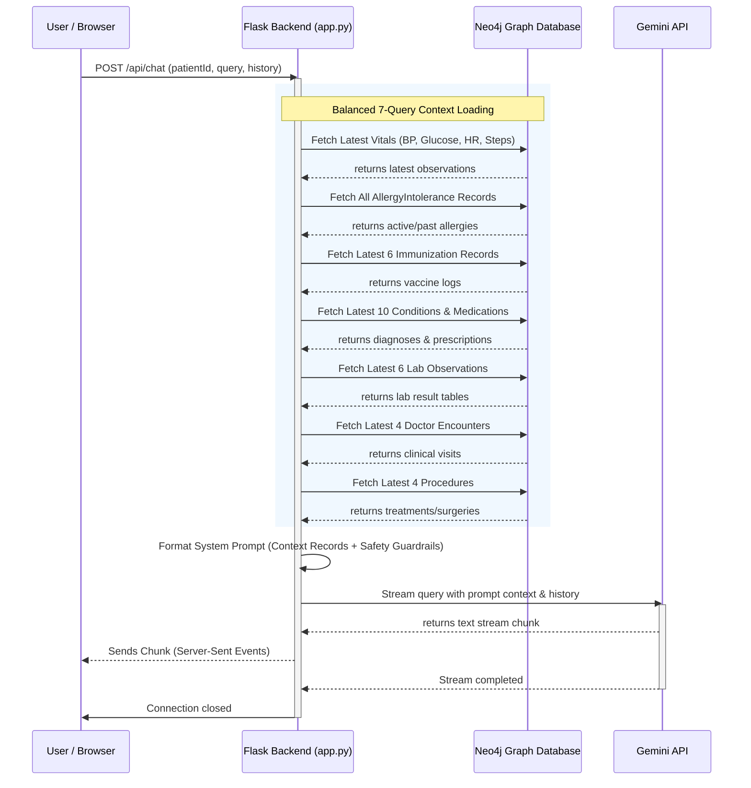

# Hekma — Architecture & Deployment Guide

This document details the system architecture, database graph schema, Retrieval-Augmented Generation (RAG) pipeline, and local/production deployment guides for the **Hekma Patient Portal**.

---

## 1. System Architecture Overview

Hekma is built using a modern decoupled architecture consisting of a React-based single-page application (SPA) frontend, a lightweight Flask REST API backend, and a Neo4j Graph Database.



### Components:
1. **Frontend (Client)**: Built with **Vite**, **TanStack Start (SSR)**, **React**, and **Vanilla CSS** for design tokens. It serves the clinical overview dashboard, medical history sheets, clinical trial matching, and the interactive EHR chatbot panel.
2. **Backend (API)**: A **Flask (Python)** server that handles patient record lookups and coordinates the reasoning/chat routing via a streaming server-sent events (SSE) endpoint.
3. **Database (Graph)**: A **Neo4j** instance that houses patient demographics and clinical records as nodes connected via semantic relationships.
4. **AI Reasoning Service**: Powered by **Gemini API**, utilizing prompt context retrieval (RAG) to ensure the chatbot answers only using the patient's verified EHR database records.

---

## 2. Database Graph Model (Neo4j)

The clinical database is modeled as a graph rather than a relational set of tables to support rapid traversal of record relationships and flexible resource structures.



* **Patient Node (`:Patient`)**: Represents a unique patient in the EHR system.
* **Record Node (`:Record`)**: Houses individual clinical records (FHIR mapping categories like `Observation`, `Condition`, `MedicationStatement`, `MedicationRequest`, `AllergyIntolerance`, `Immunization`, `Encounter`, and `Procedure`).
* **Relationship (`:HAS_RECORD`)**: Links a patient to their clinical timeline records.

---

## 3. Retrieval-Augmented Generation (RAG) Flow

To prevent context-crowding (where a patient's massive medication list consumes the prompt space and cuts off critical vital signs or allergies), Hekma implements a **7-Query Balanced Context Retrieval** strategy in Python before formatting the prompt for the Gemini LLM:



---

## 4. Local Setup & Configuration

### Prerequisites
* **Python 3.10+**
* **Node.js 18+**
* **Neo4j Desktop** or **Neo4j AuraDB** (running locally on port 7687)

### Step 1: Environment Variables
Create a `.env` file in the `backend/` folder:
```env
GEMINI_API_KEY=your_gemini_api_key_here
NEO4J_URI=bolt://localhost:7687
NEO4J_USER=neo4j
NEO4J_PASSWORD=your_password_here
FLASK_ENV=development
```

### Step 2: Running Backend Server
```bash
cd backend
python -m venv venv
# Windows:
.\venv\Scripts\activate
# Mac/Linux:
source venv/bin/activate

pip install -r requirements.txt
python app.py
```
*Backend runs locally at `http://127.0.0.1:5000`.*

### Step 3: Running Frontend Client
```bash
cd my-ehr-guide
npm install
npm run dev
```
*Frontend runs locally at `http://localhost:8080` (with dev server proxy mapping `/api` calls to port 5000).*

---

## 5. Production Deployment Guide

### A. Deploying the Frontend (Vite SSR / Nitro)
The frontend utilizes TanStack Start, which builds a highly optimized output using Nitro.

1. **Build Production Bundle**:
   ```bash
   cd my-ehr-guide
   npm run build
   ```
2. **Deploy Targets**:
   * **Cloudflare Pages / Workers**: The project includes a wrangler deploy target configuration (`wrangler.json` is auto-generated inside `.output/server/`). Deploy using:
     ```bash
     npx wrangler deploy
     ```
   * **Vercel / Netlify**: Connect the GitHub repository directly and select **Vite / TanStack Start** preset.
   * **Docker / Node VM**: You can run the built Node server directly:
     ```bash
     node .output/server/index.mjs
     ```

### B. Deploying the Flask Backend
For production environments, do not run the built-in Flask WSGI server. Instead, deploy using a WSGI container:

1. **Using Gunicorn (Linux/Docker)**:
   ```bash
   pip install gunicorn
   gunicorn --workers 4 --bind 0.0.0.0:5000 app:app
   ```
2. **Containerization (Dockerfile)**:
   ```dockerfile
   FROM python:3.10-slim
   WORKDIR /app
   COPY backend/requirements.txt requirements.txt
   RUN pip install --no-cache-dir -r requirements.txt
   COPY backend/ .
   EXPOSE 5000
   CMD ["gunicorn", "--workers", "4", "--bind", "0.0.0.0:5000", "app:app"]
   ```

### C. Deploying Neo4j (Graph Database)
* **Neo4j AuraDB (Recommended)**: Cloud-managed Neo4j instances. Highly reliable, handles scaling, backups, and encryption out-of-the-box. Change `NEO4J_URI` in `backend/.env` to point to the secure `neo4j+s://` Aura connection link.
* **Self-Hosted VM**: Run Neo4j inside a Docker container on AWS EC2, GCP Compute Engine, or Azure VM, opening port `7687` only to the Flask Backend IP address.

---

## 6. Key Features & Guardrails

* **Patient-Scoped Storage**: Chat history is stored in local storage under patient-isolated keys (`hekma.chat.${patientId}.v1`) to prevent mixing patient contexts.
* **Null-Safe UI Rendering**: Memos generating welcome questions explicitly guard against missing clinical record fields or empty observations, preventing layout crashes.
* **Automatic Record Association**: Clicking suggested questions in the dashboard or chat welcome views automatically pre-attaches the corresponding FHIR record ID to the RAG prompt, guaranteeing deep context grounding.
